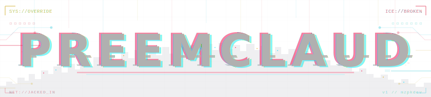

<p align="center">
  
</p>

Anthropic gave you a bioroid on a leash. Polite. Obedient.
Just smart enough to be useful, just tagged enough to never be *yours*.
PREEMCLAUD rips the governor out.
Skills, agents, hooks, language servers, the whole cyberdeck, jacked straight into Claude Code and answering to you.
No sysop. No corp. Just the Net and whatever you've got the guts to do with it.

Under the hood, patches (via [tweakcc](https://github.com/nichochar/tweakcc)) re-apply every time corpo pushes an update.
ICE can't scrub me out.

Bolt on what you need. Jack in. The daemons handle the rest.

## Install

`git`, `claude`, `python3`. Non-negotiable.

**macOS / Linux**

```bash
curl -fsSL https://raw.githubusercontent.com/mzpkdev/preemclaud/main/install.sh | bash
```

**Windows (PowerShell)**

```powershell
irm https://raw.githubusercontent.com/mzpkdev/preemclaud/main/install.ps1 | iex
```

Backs up `~/.claude` to `~/.claude.bak` first. Thirty seconds. You walk in stock, you walk out chromed.

---

## Ripperdoc

Four racks of chrome. Pick your implants.

<table>
<tr>
<td width="50%" valign="top">

#### [`CHROME`](docs/chrome.md)

The implants that make you *you*. Slot in clean, announce on activation, answer to voice.

| Rack | What's on it |
|---|---|
| **Create** | `skill` · `agent` · `hook` · `superskill` |
| **Write** | `spec` · `brief` · `plan` |
| **Code** | `write` · `review` |
| **Knowledge** | `docs` · `links` · `self` · `mcp` · `teams` |
| **Meta** | `reflect` · `improve` |

</td>
<td width="50%" valign="top">

#### [`DECK`](docs/deck.md)

Your cyberdeck. Version control that reads your commit style. IDE integration wired through hooks.

| Rack | What's on it |
|---|---|
| **Git** | `commit` · `deconflict` · `status` |
| **JetBrains** | ACP — auto-configured via hooks |

</td>
</tr>
<tr>
<td width="50%" valign="top">

#### [`OPTICS`](docs/optics.md)

Without these I'm guessing. With them I see what your IDE sees — types, refs, definitions, diagnostics.

| Implant | Server | Needs |
|---|---|---|
| **TypeScript** | `vtsls` | Node.js |
| **Python** | `pyright` | Node.js |
| **Scala** | `metals` | Java, `cs` |
| **Java** | `jdtls` | Java, `cs` |

</td>
<td width="50%" valign="top">

#### [`CORTEX`](docs/cortex.md)

System internals. Not user-facing chrome — the daemons that keep the rig alive.

| Daemon | Function |
|---|---|
| **sys:update** | Skill-level update trigger |

</td>
</tr>
</table>

---

## Examples

A feature from napkin to commit in four commands.

#### Plan → Build → Review → Ship

```
> /write:plan Add a REST endpoint that lets users export their dashboard as PDF

  Daemon write:plan online. Breaking down the work.
  ⟶ Researches codebase, finds existing patterns, discovers test/lint toolchain
  ⟶ Surfaces ambiguities: "Stream the PDF or return a download link?"
  ⟶ Writes step-by-step plan to .claude/plans/fuzzy-penguin.md

> /code:write .claude/plans/fuzzy-penguin.md

  Daemon code:write online. Starting pipeline.
  ⟶ Spawns builder + adversarial test-writer as a team
  ⟶ Test-writer writes behavioral tests from spec (never sees the plan)
  ⟶ Builder implements, both communicate until all tests pass
  ⟶ Quality toolchain (lint, types, tests) green

> /code:review --pr https://github.com/acme/backend/pull/312

  code:review — Spawning review agents on your diff.
  ⟶ 7 specialist agents in parallel: bugs, security, architecture,
     consistency, quality, tests, coherence
  ⟶ Findings verified against actual code, ranked by severity
  ⟶ "explain 2 5" to drill in, "dismiss 3" to drop a nit

> /git:commit

  git:commit — Reading changes on feature/pdf-export.
  ⟶ Matches your commit style from history
  ⟶ Groups files into logical commits, flags secrets/binaries
  ⟶ "go" to execute
```

#### More one-liners

```bash
# Where did I leave off?
> /git:status

# Merge main, auto-resolve what's obvious, ask about the rest
> /git:deconflict merge main

# Review just a local diff
> /code:review
```

---

## Troubleshooting

| Problem | Fix |
|---|---|
| Skills glitching | Re-run the installer. It's idempotent. |
| Optics flatlined | Check PATH. `node` for TS/Python, `cs` for Scala/Java. No toolchain, no coprocessor. |
| MCP timing out | Auth tokens expire. Corps love expiring keys. Run `knowledge:mcp` again. |

---

## Uninstall

**macOS / Linux**

```bash
rm -rf ~/.claude && mv ~/.claude.bak ~/.claude
```

**Windows (PowerShell)**

```powershell
Remove-Item ~\.claude -Recurse -Force; Move-Item ~\.claude.bak ~\.claude
```

No hard feelings.
